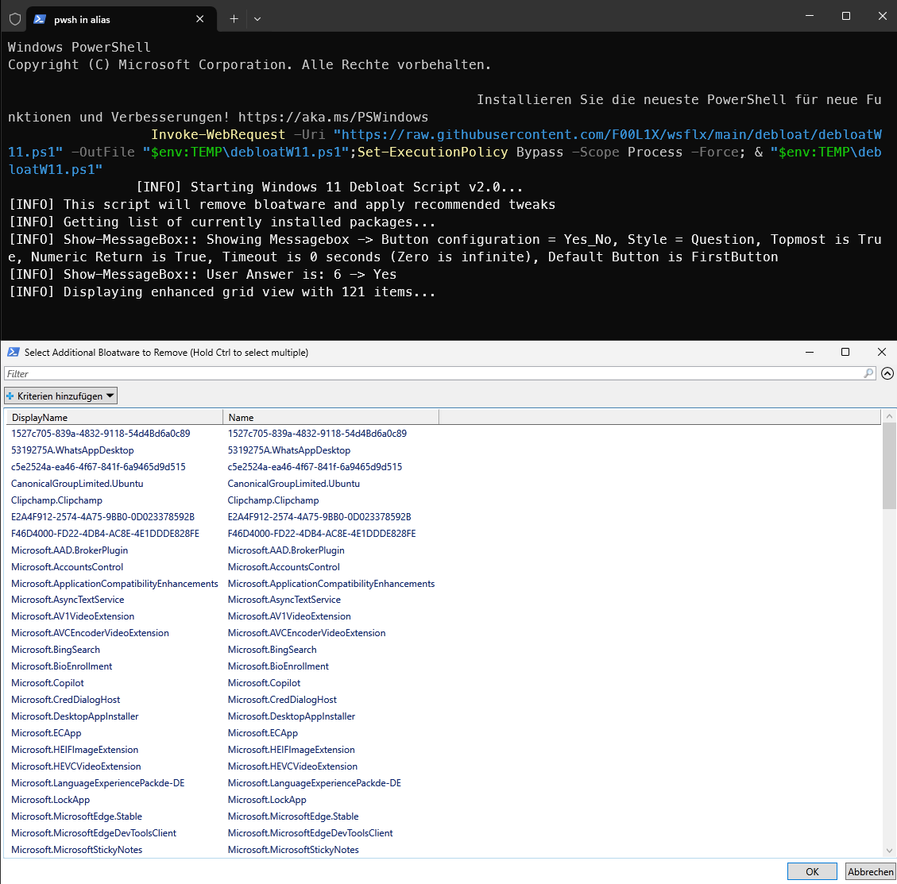
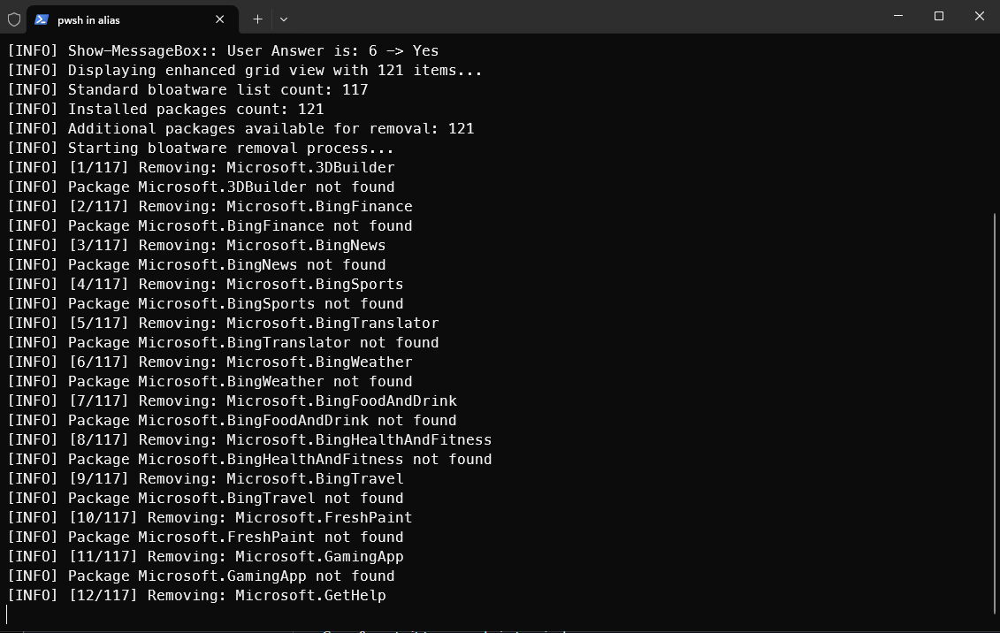
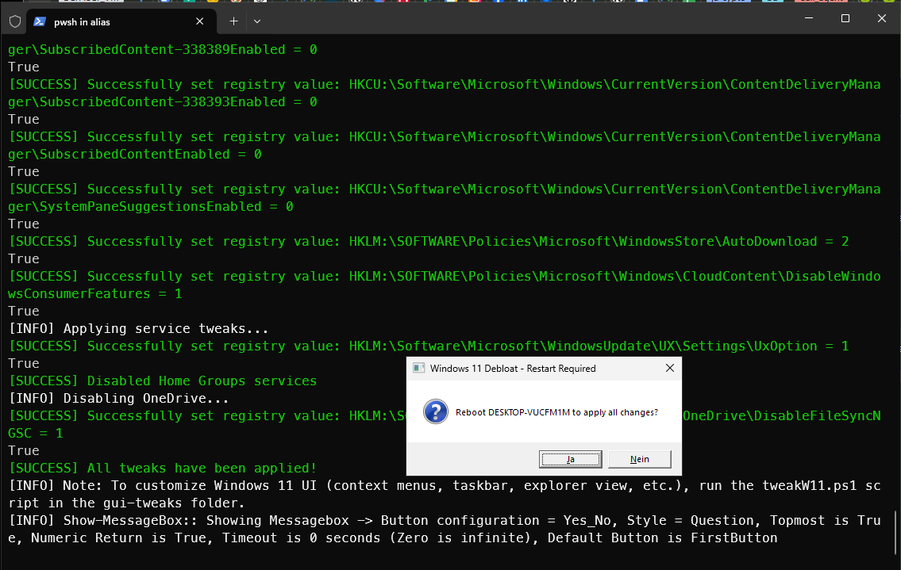

# 🧹 Windows 11 Debloat Script

A powerful PowerShell script designed to remove unnecessary bloatware, disable telemetry, and enhance privacy in Windows 11.

[↩️ Back to Main Readme](../README.md)

## 📋 Table of Contents
- [Features](#features)
- [Usage](#usage)
  - [Prerequisites](#prerequisites)
  - [Installation](#installation)
- [How It Works](#how-it-works)
- [UI Customization](#ui-customization)
- [Caution](#caution)
- [Frequently Asked Questions](#frequently-asked-questions)
- [License](#license)

## ✨ Features

- **🗑️ Remove Bloatware**: Automatically removes pre-installed Windows 11 apps that most users don't need
- **🔍 Bloatware Selection**: Interactive UI to select additional bloatware to remove
- **🛡️ Privacy Enhancements**: Disables telemetry, diagnostics tracking, and other privacy-intrusive features
- **⚡ Service Optimization**: Disables unnecessary services for better performance
- **☁️ OneDrive Control**: Option to disable OneDrive integration
- **🔒 Error Handling**: Robust error handling with visual feedback
- **🛡️ System Protection**: Designed to be safe and not impact system stability

## 🚀 Usage

### 📋 Prerequisites

- Windows 11
- PowerShell 5.1 or higher
- Administrator privileges

### 💻 Installation

#### Option 1: Direct download and run (recommended)

```powershell
Invoke-WebRequest -Uri "https://raw.githubusercontent.com/F00L1X/wsflx/main/debloat/debloatW11.ps1" -OutFile "$env:TEMP\debloatW11.ps1";Set-ExecutionPolicy Bypass -Scope Process -Force; & "$env:TEMP\debloatW11.ps1"
```

#### Option 2: Clone repository and run locally

```powershell
git clone https://github.com/F00L1X/wsflx.git
cd wsflx/debloat
Set-ExecutionPolicy Bypass -Scope Process -Force
.\debloatW11.ps1
```

## 🔧 How It Works

1. **Launch the script** with administrator privileges (see [Usage](#usage))
2. **Select bloatware** you want to remove
    
3. **Wait for the script** to remove selected apps and apply privacy tweaks
    
4. **Restart your system** to fully apply all changes
    

## 🖌️ UI Customization

This script focuses solely on debloating and privacy. For customizing the Windows 11 UI (context menus, taskbar, etc.), use our companion script [set-tweakW11.ps1](../ui-tweaks/set-tweakW11.ps1).

## ⚠️ Caution

- Always create a system restore point before running
- Some changes may not be easily reversible
- Some apps might be removed that you want to keep, so review the selection carefully

## ❓ Frequently Asked Questions

### Will this break my Windows installation?

No, the script is designed to be safe and only removes non-essential components.

### Can I undo the changes?

Some changes can be reversed through the Windows Settings app, but a system restore point is recommended before running.

### Why separate debloating from UI tweaks?

To provide more flexibility and focus. This script focuses on removing unnecessary components and enhancing privacy, while the UI tweaks script focuses on visual and usability enhancements.

## 📄 License

This project is licensed under the MIT License - see the [LICENSE](../LICENSE) file for details.