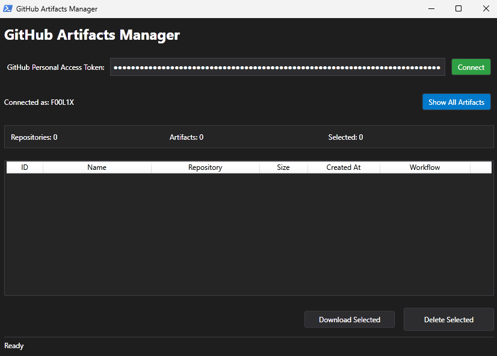
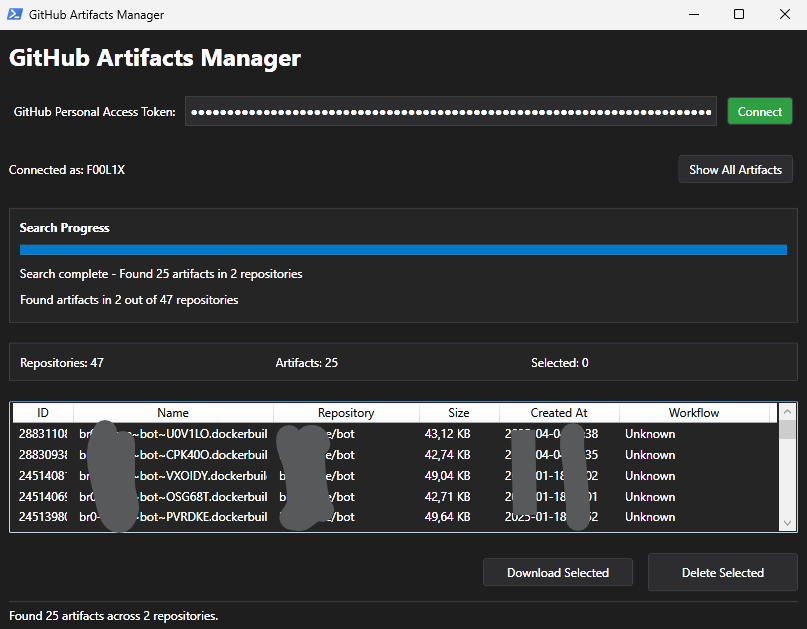

# 🗑️ GitHub Artifacts Manager

A PowerShell script with a modern dark-themed UI to manage GitHub workflow artifacts across all your repositories.

## 🌟 Features

- 🎨 Modern dark-themed UI
- 🔑 GitHub PAT authentication
- 🔍 Search artifacts across all repositories
- 📊 Progress tracking and detailed status updates
- 📥 Bulk artifact downloads
- 🗑️ Bulk artifact deletion
- 📋 Detailed artifact information display
- 🎯 Multi-select functionality
- 📂 Automatic download organization by repository

## 📸 Screenshots

### Search Progress

*Real-time progress tracking during artifact search with detailed console output*

### Result Interface

*The main interface showing the dark theme, artifact list, and control buttons*

## 🚀 Quick Start

### Option 1: Download and run (recommended)
Downloads and runs the script directly without cloning the entire repository:
```powershell
Invoke-WebRequest -Uri "https://raw.githubusercontent.com/F00L1X/wsflx/main/git/manage-git-artifacts.ps1" -OutFile "$env:TEMP\manage-git-artifacts.ps1";Set-ExecutionPolicy Bypass -Scope Process -Force; & "$env:TEMP\manage-git-artifacts.ps1"
```

**What this does:**
1. Downloads the script from GitHub to your temporary folder
2. Temporarily bypasses PowerShell execution policy for this session
3. Launches the GitHub Artifacts Manager GUI

### Option 2: Clone and run locally
Clones the entire repository to your machine for offline access and easier updates:
```powershell
git clone https://github.com/F00L1X/wsflx.git; cd wsflx/git; Set-ExecutionPolicy Bypass -Scope Process -Force; .\manage-git-artifacts.ps1
```

**What this does:**
1. Clones the entire wsflx repository to your current directory
2. Navigates to the git folder
3. Temporarily bypasses PowerShell execution policy
4. Runs the GitHub Artifacts Manager

**Benefits of cloning:**
- Access to all scripts in the repository
- Easy to update with `git pull`
- Can customize the script locally
- No internet required after initial clone

## 🔧 Requirements

- Windows PowerShell 5.1 or later
- GitHub Personal Access Token (PAT) with the following permissions:
  - `repo` - Full control of private repositories
  - `workflow` - Update GitHub Action workflows
  - `read:packages` - Read packages from GitHub Package Registry

## 📝 Usage

1. Launch the script
2. Enter your GitHub Personal Access Token
3. Click "Connect" to validate your token
4. Click "Show All Artifacts" to scan your repositories
5. Select artifacts from the list (multi-select supported)
6. Use "Download Selected" or "Delete Selected" buttons to manage artifacts

## 🎯 Features in Detail

### Authentication
- Secure PAT input field
- Token validation with visual feedback
- Connection status display

### Repository Scanning
- Automatic scanning of all accessible repositories
- Progress tracking with detailed status updates
- Repository count and artifact statistics

### Artifact Management
- List view with sortable columns:
  - Artifact ID
  - Name
  - Repository
  - Size (formatted)
  - Creation Date
  - Workflow Name
- Multi-select capability
- Bulk download with automatic folder organization
- Secure deletion with confirmation

### Progress Tracking
- Real-time progress updates
- Detailed status messages
- Error handling with user notifications
- Console logging for debugging

## ⚙️ Configuration

The script automatically:
- Creates a download directory in your user's Downloads folder
- Organizes downloaded artifacts by repository
- Maintains a clean UI state between operations

## 🔒 Security

- PAT is never stored permanently
- Secure token handling
- Confirmation required for deletions
- Error handling for permission issues

## 🐛 Troubleshooting

Common issues and solutions:

1. **Token Invalid**: Ensure your PAT has the required permissions
2. **No Artifacts Found**: Verify that:
   - Repositories have GitHub Actions configured
   - Workflows are generating artifacts
   - Your PAT has sufficient permissions
3. **Download Errors**: Check:
   - Available disk space
   - Write permissions in Downloads folder
   - Network connectivity

## 📚 Contributing

Contributions are welcome! Please feel free to submit a Pull Request.

## 📄 License

This project is licensed under the MIT License - see the [LICENSE](../LICENSE) file for details.