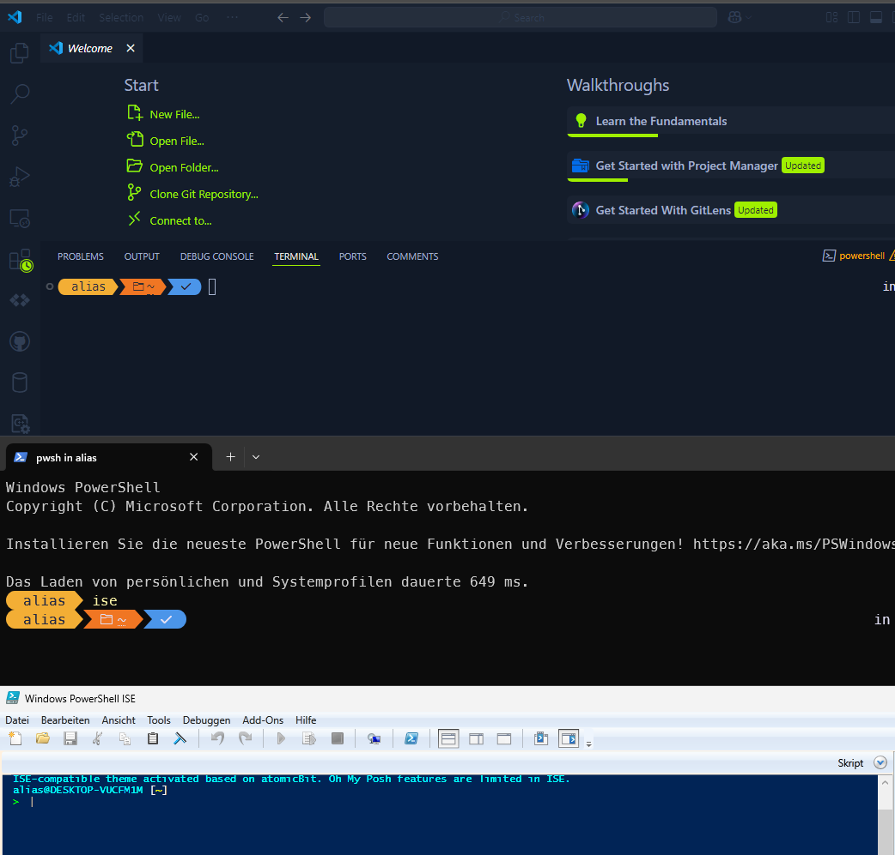

# 🎨 Terminal Styling for Windows

A PowerShell script that automatically styles your terminal environment for Windows with Oh My Posh, custom fonts, and configuration for popular terminals and IDEs.

[↩️ Back to Main Readme](../README.md)

## 📋 Table of Contents
- [What This Script Does](#-what-this-script-does)
- [Preview](#preview)
- [Features](#-features)
- [Configures These Components](#-configures-these-components)
- [Requirements](#-requirements)
- [Installation](#-installation)
- [Troubleshooting](#-troubleshooting)
- [Credits](#-credits)
- [License](#-license)

## ✨ What This Script Does

This script automates the setup of a beautiful and highly functional terminal environment by:

1. **Installing Oh My Posh** - A prompt theme engine for any shell that adds colorful, informative prompts
2. **Installing Meslo Nerd Font** - Automatically fetches and installs the latest version of Meslo font with programming ligatures and icons
3. **Configuring PowerShell profile** - Sets up Oh My Posh with the sleek "craver" theme
4. **Styling Windows Terminal** - Updates settings for beautiful fonts and colors
5. **Configuring VS Code and Cursor terminals** - Updates integrated terminal settings to use Nerd Fonts
6. **Providing a status dashboard** - Shows a beautiful report of all changes made

After running, you'll have a stylish, feature-rich terminal environment ready for productive coding!

## 📸 Preview


## 🚀 Features

- ✅ **Fully Automated** - No manual steps required
- ✅ **Cross-Version Compatible** - Works on Windows 7, 8, 10, and 11
- ✅ **Error-Safe** - Robust error handling with detailed feedback
- ✅ **Multiple Installation Methods** - Supports both winget and direct installation
- ✅ **Dynamic Path Detection** - Automatically finds configuration files regardless of installation method
- ✅ **Preserves Customizations** - Keeps your existing custom headers and comments in config files
- ✅ **Always Latest Version** - Dynamically fetches the latest Nerd Font release
- ✅ **Beautiful Status Dashboard** - Visualizes installation progress and success

## ⚙️ Configures These Components

| Component | What Gets Configured |
|-----------|----------------------|
| **Oh My Posh** | Installs the latest version and configures with the "craver" theme |
| **Nerd Fonts** | Installs MesloLGM Nerd Font with programming ligatures and icons |
| **PowerShell** | Updates profile to initialize Oh My Posh on startup |
| **Windows Terminal** | Configures font settings for improved aesthetics |
| **VS Code** | Updates integrated terminal settings to use Nerd Fonts |
| **Cursor** | Updates integrated terminal settings to use Nerd Fonts |

## 📋 Requirements

- Windows 7 or higher
- PowerShell 5.1 or higher
- Internet connection (for downloading fonts and Oh My Posh)
- Administrator privileges (recommended but not required)

## 💻 Installation

### Option 1: Direct download and run (recommended)

```powershell
Invoke-WebRequest -Uri "https://raw.githubusercontent.com/F00L1X/wsflx/main/terminal-styling/style_terminal_w11.ps1" -OutFile "$env:TEMP\style_terminal_w11.ps1";Set-ExecutionPolicy Bypass -Scope Process -Force; & "$env:TEMP\style_terminal_w11.ps1"
```

### Option 2: Clone repository and run locally

```powershell
git clone https://github.com/F00L1X/wsflx.git
cd wsflx/terminal-styling
Set-ExecutionPolicy Bypass -Scope Process -Force
.\style_terminal_w11.ps1
```

## 🔍 Troubleshooting

If you encounter any issues:

1. **Font not showing correctly?** Restart your terminal/IDE
2. **Script fails with permissions?** Try running PowerShell as Administrator
3. **Can't install Oh My Posh?** The script will automatically try alternative installation methods

## 🙌 Credits

- [**Oh My Posh**](https://ohmyposh.dev/) - The powerful prompt theme engine
- [**Nerd Fonts**](https://www.nerdfonts.com/) - Iconic font aggregator
- [**JanDeDobbeleer**](https://github.com/JanDeDobbeleer) - Creator of Oh My Posh
- [**F00L1X**](https://github.com/F00L1X/wsflx) - Creator of this script

## 📄 License

This project is licensed under the MIT License - see the [LICENSE](../LICENSE) file for details.
