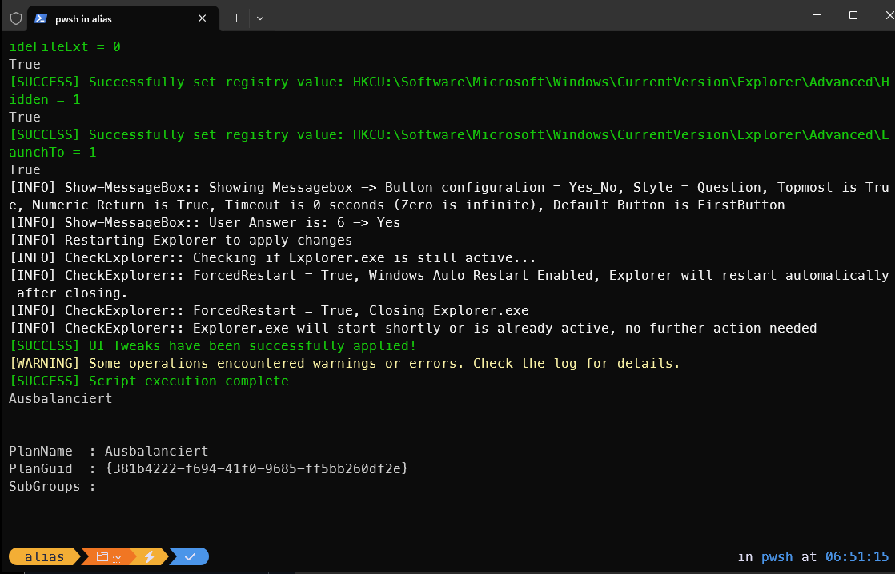
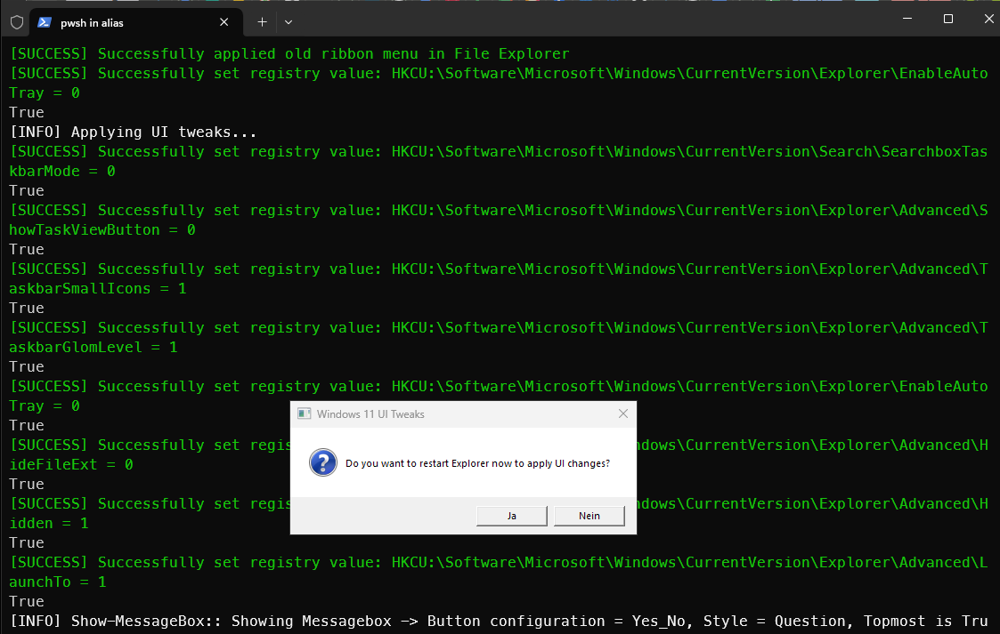
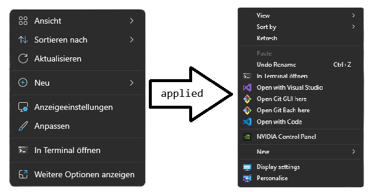
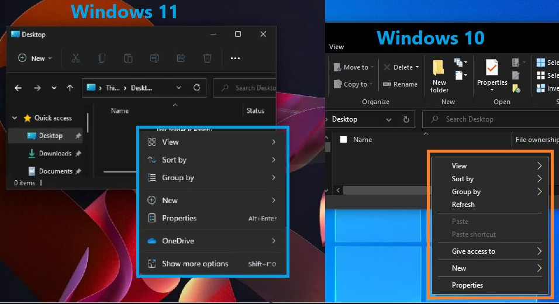

# 🖌️ Windows 11 UI Tweaks

A specialized PowerShell script designed to customize the Windows 11 user interface for improved usability and appearance.

[↩️ Back to Main Readme](../README.md)

## 📋 Table of Contents
- [Features](#features)
- [Usage](#usage)
  - [Prerequisites](#prerequisites)
  - [Installation](#installation)
  - [Uninstallation](#uninstallation)
- [How It Works](#how-it-works)
- [Screenshots](#screenshots)
- [Windows Debloating](#windows-debloating)
- [Caution](#caution)
- [Frequently Asked Questions](#frequently-asked-questions)
- [License](#license)

## ✨ Features

- **🔄 Classic Context Menu**: Restore the more functional Windows 10-style context menu
- **📁 Explorer Ribbon Menu**: Get back the classic File Explorer ribbon interface
- **⚙️ Taskbar Customization**:
  - Show small icons in taskbar
  - Show titles in taskbar
  - Show all tray icons
  - Hide search box/button
  - Hide Task View button
- **🔍 Explorer Enhancements**:
  - Show file extensions
  - Show hidden files
  - Change default explorer view to "Computer"
- **🛡️ Error Handling**: Robust error handling with visual feedback
- **🔄 Explorer Auto-Restart**: Safely restarts Explorer to apply changes

## 🚀 Usage

### 📋 Prerequisites

- Windows 11
- PowerShell 5.1 or higher
- Administrator privileges

### 💻 Installation

#### Option 1: Direct download and run (recommended)
Downloads and runs the script directly without cloning the entire repository:
```powershell
Invoke-WebRequest -Uri "https://raw.githubusercontent.com/F00L1X/wsflx/main/ui-tweaks/set-tweakW11.ps1" -OutFile "$env:TEMP\set-tweakW11.ps1";Set-ExecutionPolicy Bypass -Scope Process -Force; & "$env:TEMP\set-tweakW11.ps1"
```

**What this does:**
1. Downloads the script from GitHub to your temporary folder
2. Temporarily bypasses PowerShell execution policy for this session
3. Executes the UI tweaks script

#### Option 2: Clone repository and run locally
Clones the entire repository to your machine for offline access and easier updates:
```powershell
git clone https://github.com/F00L1X/wsflx.git
cd wsflx/ui-tweaks
Set-ExecutionPolicy Bypass -Scope Process -Force
.\set-tweakW11.ps1
```

**What this does:**
1. Clones the entire wsflx repository to your current directory
2. Navigates to the ui-tweaks folder
3. Temporarily bypasses PowerShell execution policy
4. Runs the UI tweaks script

**Benefits of cloning:**
- Access to all scripts in the repository
- Easy to update with `git pull`
- Can customize tweaks before applying
- No internet required after initial clone

### 🔄 Uninstallation

#### Option 1: Direct download and run (recommended)
Downloads and runs the revert script directly:
```powershell
Invoke-WebRequest -Uri "https://raw.githubusercontent.com/F00L1X/wsflx/main/ui-tweaks/revert-tweakW11.ps1" -OutFile "$env:TEMP\revert-tweakW11.ps1";Set-ExecutionPolicy Bypass -Scope Process -Force; & "$env:TEMP\revert-tweakW11.ps1"
```

**What this does:**
1. Downloads the revert script from GitHub to your temporary folder
2. Temporarily bypasses PowerShell execution policy for this session
3. Executes the revert script to undo all UI tweaks

#### Option 2: Clone repository and run locally
If you already have the repository cloned:
```powershell
cd wsflx/ui-tweaks
Set-ExecutionPolicy Bypass -Scope Process -Force
.\revert-tweakW11.ps1
```

## 🔧 How It Works

1. **Launch the script** with administrator privileges (see [Installation](#installation))
2. **Apply UI tweaks** automatically

3. **Prompt for Explorer restart** to apply changes immediately

4. **Enjoy a more user-friendly Windows 11 interface**

## 📸 Screenshots

### Before & After: Context Menu
*Images showing the default Windows 11 context menu vs the classic menu*


### Before & After: File Explorer
*Images showing the redesigned Windows 11 explorer vs the classic explorer*


## 🧹 Windows Debloating

This script focuses solely on UI customization.
For removing bloatware and enhancing privacy, use our companion script [debloatW11.ps1](../debloat/debloatW11.ps1).

## ⚠️ Caution

- Always create a system restore point before running
- Some changes may not be easily reversible
- Explorer will need to be restarted to apply changes
- Sometimes it's required to restart your system to see the changes

## ❓ Frequently Asked Questions

### Will this affect my Windows updates?

No, these UI tweaks don't interfere with the Windows Update mechanism.

### Can I undo these changes?

Yes, most changes can be reverted manually through registry edits or by running specialized commands.
Or simply use the [Uninstall Script](#uninstallation)

### Why separate UI tweaks from debloating?

To provide more flexibility and focus. This script focuses on visual and usability enhancements, while the debloat script focuses on removing unnecessary components and enhancing privacy.

## 📄 License

This project is licensed under the MIT License - see the [LICENSE](../LICENSE) file for details.